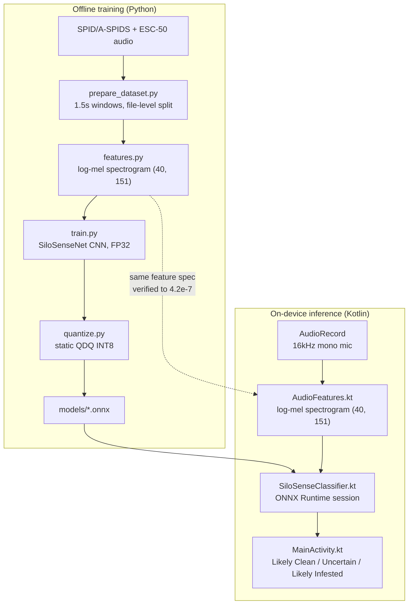
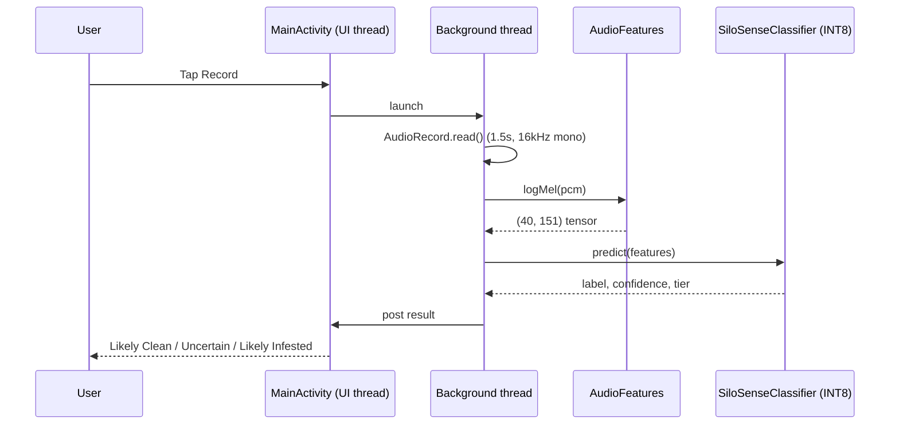

# SiloSense

On-device, Arm-optimized audio classifier for stored-grain insect infestation. Built for the **Arm Create: AI Optimization Challenge 2026** (Mobile AI track).

Postharvest grain loss in Zimbabwe and the wider SADC region runs at 30% or more in many years, and most of it is invisible until the damage is already visible. SiloSense listens instead of looking: insects moving through stored grain produce a real acoustic signature, well before any visual sign of damage. The whole pipeline, from a 1.5-second recording to a result, runs on-device, offline, on an ordinary Android phone.

This README documents the code. For the fuller problem framing, a field scenario, and the full benchmark writeup with real measured Arm hardware data, see the submission document (not tracked in this repo; generated locally from `submission/generate_writeup.js`).

## Architecture

Training happens offline in Python. Inference happens on-device in Kotlin. Both stages compute the same log-mel feature spectrogram from the same spec, and that equivalence is checked, not assumed (see [Porting & parity](#porting--parity) below).



## Dataset & pipeline

Training data is the [SPID / A-SPIDS dataset](https://www.kaggle.com/datasets/dkadyrov/stored-product-insect-database-spidb-aspids) (Kaggle, Daniel Kadyrov, MIT-licensed): real acoustic recordings of three stored-grain pests (*Callosobruchus maculatus*, *Tribolium confusum*, *Tenebrio molitor*) across five materials, plus real background-noise recordings and a genuine no-insects negative class. The full dataset is 106GB across roughly 12,900 files. `index_files.py` matches the dataset's own label log (`aspids_log.csv`) against each session's inner recording timestamp, not the outer date folder Kaggle shows, which is a batch export date rather than the true recording date. Getting that join right is what makes the ~246MB downloaded subset actually label-verified rather than guessed.

`fetch_esc50.py` adds ESC-50 environmental clips (capped at 180 files) to broaden the clean class. `prepare_dataset.py` slices everything into 1.5-second windows and splits train/validation **at the file level**, not the window level, so near-identical adjacent windows from the same recording can't leak across the split.

| Stage | Script | Output |
|---|---|---|
| Discover | `scripts/index_files.py` | Sessions matching real logged dates in the 106GB listing |
| Download | `scripts/download_subset.py` | 246MB label-verified subset, joined against `aspids_log.csv` |
| Negatives | `scripts/fetch_esc50.py` | ESC-50 clips for clean-class diversity |
| Prepare | `scripts/prepare_dataset.py` | `data/manifest.csv`, 1.5s windows, file-level train/val split |
| Features | `scripts/features.py` | (40, 151) log-mel spectrogram, pure NumPy, no librosa |
| Model | `scripts/model.py` | SiloSenseNet CNN definition |
| Train | `scripts/train.py` | FP32 baseline, exported to ONNX |
| Quantize | `scripts/quantize.py` | Static QDQ INT8, accuracy re-verified |

## Model

`SiloSenseNet` is a four-block CNN: `Conv2d → BatchNorm → ReLU → MaxPool`, repeated at 16, 32, 64, and 128 channels, ending in adaptive average pooling and a linear classifier to two classes (clean, infested). About 98,000 parameters, 0.39MB in FP32.

The size is deliberate. An earlier ~6,000-parameter version ran fast enough that fixed kernel-launch and quantization overhead made INT8 look *slower* than FP32 in local testing. The model was sized up so there's enough real multiply-accumulate work for an Arm INT8 dot-product path to show a genuine, measurable win.

Trained for 15 epochs with Adam (lr 1e-3, weight decay 1e-4), loss class-weighted inversely to each class's frequency in the training split. The checkpoint with the best validation F1 is kept and exported to ONNX with a dynamic batch axis.

## Quantization

Static QDQ INT8 (`scripts/quantize.py`), MinMax calibration over 100 real training clips. Static, not dynamic: ONNX Runtime's dynamic quantization only touches MatMul/Gemm by default, which on this model (three Conv2d blocks, one small final Gemm) would leave almost everything in FP32. Static quantization with a real calibration pass actually quantizes the convolution layers, which is what Arm's INT8 SIMD/dot-product paths accelerate.

## Results

| | FP32 | INT8 (static QDQ) | Change |
|---|---|---|---|
| Model size | 0.393 MB | 0.111 MB | 3.54x smaller |
| Validation accuracy | 98.99% | 100.00% | no loss (small val set: the INT8 number edging out FP32 is noise) |
| Validation F1 | 0.985 | 1.000 | no loss |
| On-device inference (Galaxy M16, Arm CPU) | 2.78 ms avg | 1.17 ms avg | 2.38x faster |

On-device numbers: both models loaded and benchmarked in the same run for a matched pair, ten warm-up runs discarded, fifty timed runs averaged, timing isolated to `session.run()` only. A separate desktop CPU-only cross-check (AMD Ryzen 5 PRO 8540U, x86_64, no XNNPACK available) showed a smaller 1.28x speedup (0.226ms to 0.176ms), in `models/x86_cpu_benchmark.json`. The two aren't directly comparable (different chip classes, different execution paths), but together they show the INT8 win holds independent of Arm-specific acceleration, and is larger *with* it.

### What actually executed the model

Registering NNAPI as an execution provider is not the same as NNAPI running a node. `SiloSenseClassifier.kt` enables ONNX Runtime's session profiling, runs real inferences, and parses the resulting trace for each node's actual provider. On the test device, for both models, **NNAPI registered but never appears against a single node.** The real work ran on `XnnpackExecutionProvider` and `CPUExecutionProvider`. FP32: 80 nodes on XNNPACK, 50 on CPU. INT8: 70 on XNNPACK, 100 on CPU.

Model load time is also measured directly, not assumed: FP32 loads in 8.9ms; INT8 loads in 472.4ms, about 50x slower despite being a third of the size, most likely because NNAPI/XNNPACK compile the QDQ quantized graph into their own representation on first load. INT8 wins decisively on steady-state latency and size. It does not win on cold start, on this device. Reported because it's true, not smoothed over.

Also measured, not assumed: process memory (PSS) at baseline (47,829 KB), after both models load (126,554 KB, +78,725 KB), and after the benchmark run (149,185 KB, +22,631 KB more); and thermal status via `PowerManager` immediately before and after the benchmark (`NONE` both times: real but narrow evidence against throttling during this specific short run, not a claim about sustained use). Battery drain was not measured; that needs a sustained multi-minute load test this session didn't run.

## Porting & parity

`scripts/features.py`'s log-mel pipeline (reflect-pad, periodic Hann window, real FFT, 40-band Slaney-style mel filterbank, per-clip relative dB normalization) is reimplemented natively in `AudioFeatures.kt`, including a hand-rolled radix-2 FFT. No external DSP dependency on-device.

That port is checked, not assumed correct. `AudioFeaturesParityTest.kt` diffs a Kotlin-computed log-mel tensor against the Python reference on the same real audio clip: **maximum absolute difference 4.2×10⁻⁷**, effectively floating-point exact. A silent mismatch here wouldn't crash anything. It would just quietly degrade accuracy with no obvious symptom, which is the failure mode this test exists to catch.

```bash
cd android
./gradlew testDebugUnitTest --tests "com.silosense.app.AudioFeaturesParityTest"
```

## App architecture

| File | Role |
|---|---|
| `AudioFeatures.kt` | Log-mel feature extraction, pure Kotlin, verified against `features.py` |
| `SiloSenseClassifier.kt` | Wraps an ONNX Runtime session per model (INT8 for live predictions, FP32 loaded separately for benchmarking), execution-provider profiling, benchmark timing |
| `DeviceDiagnostics.kt` | Real process memory (PSS) and thermal-status readings via Android's own APIs |
| `MainActivity.kt` | Record → classify → three-tier result UI, plus Source and Full Results dialogs |

The three-tier result (Likely Clean / Uncertain / Likely Infested) isn't a 50% cutoff. The bounds (0.45 / 0.65) come from where the model's own validation data stops separating cleanly: true clean clips top out at P(infested)=0.492, true infested clips start at 0.643. There is no external standard behind this threshold; see the submission writeup's Open Problems section for what it would take to calibrate against a real grain-grading standard.



## Build & run

Requires JDK 17 and the Android SDK (platform 35, build-tools 35).

```bash
# from the android/ directory
./gradlew assembleDebug
adb install -r app/build/outputs/apk/debug/app-debug.apk
```

Both `.onnx` models and a real, MIT-licensed infested-grain sample clip are bundled as app assets, so the app builds and runs standalone. No dataset download or training run required first.

To regenerate the models from scratch:

```bash
python scripts/prepare_dataset.py
python scripts/train.py
python scripts/quantize.py
```

To regenerate the submission writeup (Node, `docx` package):

```bash
cd submission
npm install docx
node generate_writeup.js
```

## Project structure

```
scripts/              training pipeline (Python): dataset prep, features, model, train, quantize
android/               native Android app (Kotlin)
  app/src/main/java/com/silosense/app/
    AudioFeatures.kt         log-mel feature extraction
    SiloSenseClassifier.kt   ONNX Runtime wrapper + benchmarking + EP profiling
    DeviceDiagnostics.kt     real memory/thermal measurement
    MainActivity.kt          UI
  app/src/test/kotlin/       Python-vs-Kotlin feature parity test
models/                trained FP32/INT8 .onnx models + metrics + x86 cross-check
legacy_termux_proot/   archived Termux/proot deployment attempt (superseded by android/)
submission/            submission writeup generator (docx)
```

## License

MIT.
