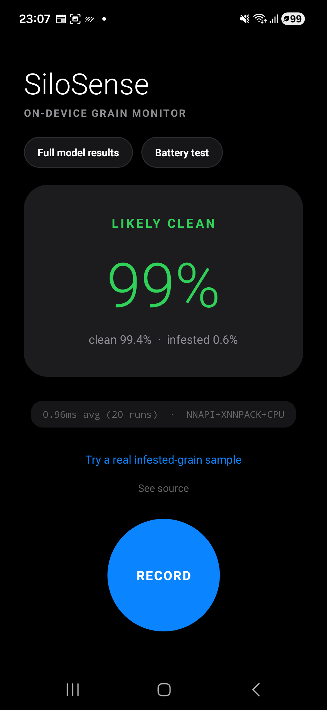
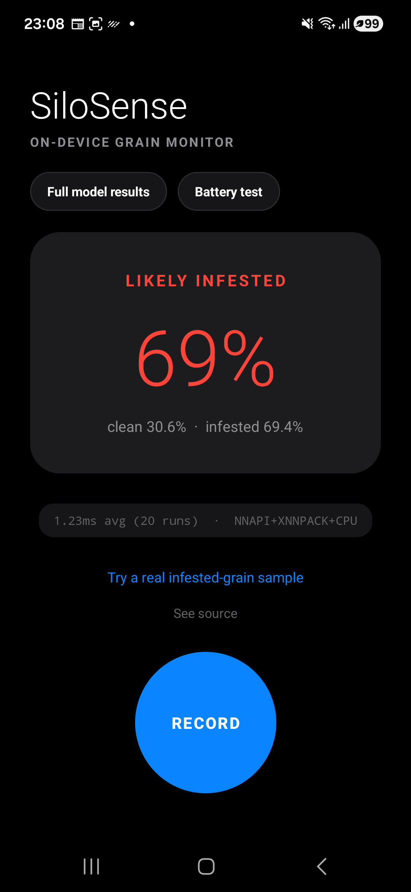
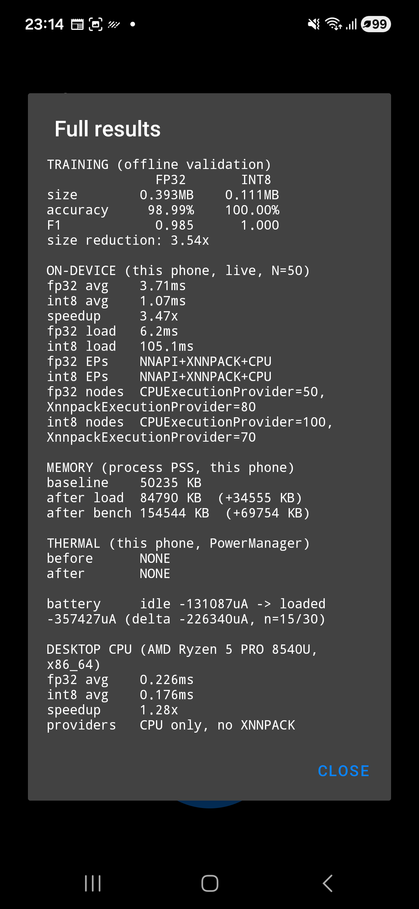
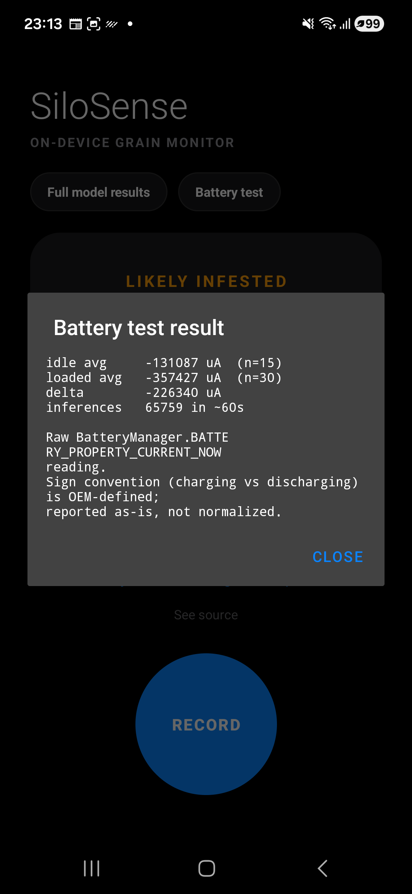
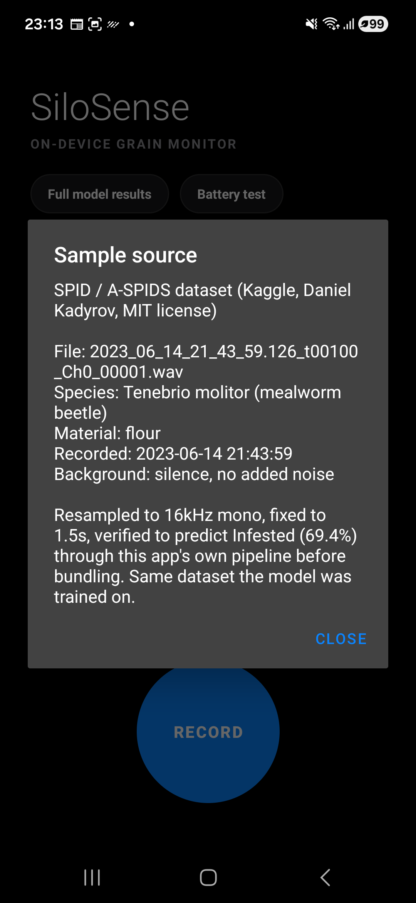
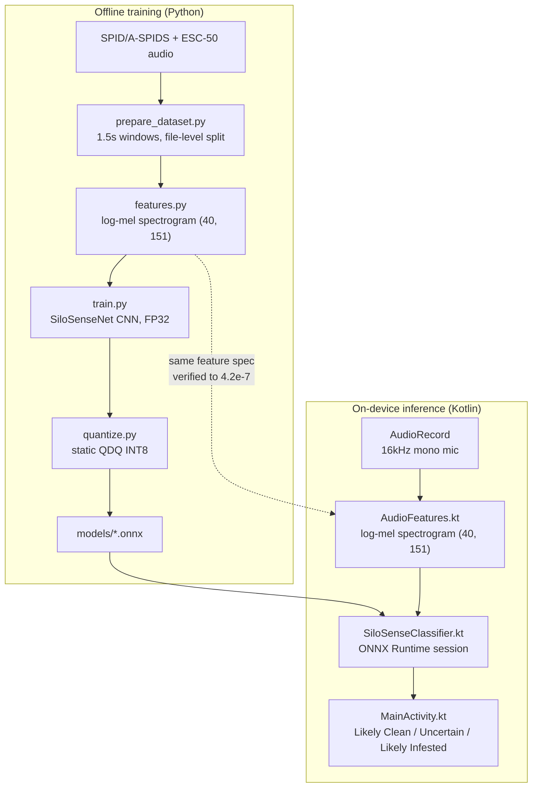
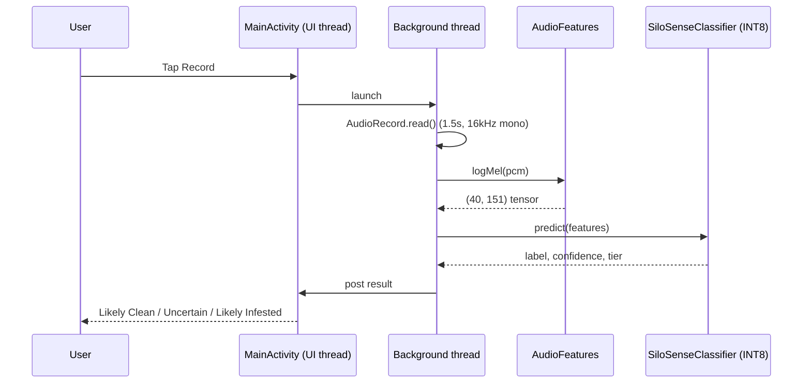

# SiloSense

On-device, Arm-optimized audio classifier for stored-grain insect infestation. Built for the **Arm Create: AI Optimization Challenge 2026** (Mobile AI track).

The output is a working Android app running a 0.11MB static-quantized INT8 ONNX model entirely on-device, plus real measured evidence of the Arm optimization: latency, which execution provider actually ran each node, memory, thermal state, and battery draw. See [Setup, build & on-device evaluation](#setup-build--on-device-evaluation) below to build and validate it yourself.

## Why this matters

Postharvest grain loss in Zimbabwe and the wider SADC region runs at 30% or more in many years. Most of it is invisible until the damage is already visible: frass, holes, a musty smell. By the time any of those show up, a meaningful share of the harvest is already gone.

Most grain production in the region comes from smallholder farmers. They store their own maize, groundnuts, and small grains at home, or sell through informal traders. The storage is a sack or a brick-and-mud room, not a sealed commercial silo. Extension visits and lab testing rarely reach that scale.

Weevils and grain borers work from inside the kernel outward. The damage stays hidden for weeks before it's obvious by eye. This matters most in years when rainfall has already been poor: postharvest loss erases part of whatever the season's climate variability left standing. Protecting a harvest that already exists is one of the highest-leverage interventions available against food insecurity. The crop is already grown. The only job left is to stop losing it.

SiloSense treats infestation detection as an audio problem instead of a visual one. Insects moving and feeding inside stored grain produce a real acoustic signature, present weeks before any visual sign of damage. A phone's microphone held against a sack picks it up long before a human eye could.

Three choices make this usable in the places that need it most:

- Fully on-device. No connection, no data cost, nothing to upload.
- Runs on hardware people already own, an ordinary Android phone. No added sensor, no added cost.
- Private by construction. Audio never leaves the phone.

The whole pipeline, from a 1.5-second recording to a result, runs on-device, offline, in under two seconds.

## Screenshots

All captured live on the test device (Samsung Galaxy M16), not mocked up.

<table>
<tr>
<td align="center"><br><sub>Live recording, clean room ambience</sub></td>
<td align="center"><br><sub>Bundled real infested-grain sample</sub></td>
<td align="center"><br><sub>Full model results</sub></td>
</tr>
<tr>
<td align="center"><br><sub>Battery test</sub></td>
<td align="center"><br><sub>See source</sub></td>
<td></td>
</tr>
</table>

## Architecture

Training happens offline in Python. Inference happens on-device in Kotlin. Both stages compute the same log-mel feature spectrogram from the same spec, and that equivalence is checked, not assumed (see [Porting & parity](#porting--parity) below).



## Dataset & pipeline

Training data is the [SPID / A-SPIDS dataset](https://www.kaggle.com/datasets/dkadyrov/stored-product-insect-database-spidb-aspids) (Kaggle, Daniel Kadyrov, MIT-licensed): real acoustic recordings of three stored-grain pests (*Callosobruchus maculatus*, *Tribolium confusum*, *Tenebrio molitor*) across five materials, plus real background-noise recordings and a genuine no-insects negative class. The full dataset is 106GB across roughly 12,900 files. `index_files.py` matches the dataset's own label log (`aspids_log.csv`) against each session's inner recording timestamp, not the outer date folder Kaggle shows, which is a batch export date rather than the true recording date. Getting that join right is what makes the ~246MB downloaded subset actually label-verified rather than guessed.

`fetch_esc50.py` adds ESC-50 environmental clips (capped at 180 files) to broaden the clean class. `prepare_dataset.py` slices everything into 1.5-second windows and splits train/validation **at the file level**, not the window level, so near-identical adjacent windows from the same recording can't leak across the split.

| Stage | Script | Output |
|---|---|---|
| Discover | `scripts/index_files.py` | Sessions matching real logged dates in the 106GB listing |
| Download | `scripts/download_subset.py` | 246MB label-verified subset, joined against `aspids_log.csv` |
| Negatives | `scripts/fetch_esc50.py` | ESC-50 clips for clean-class diversity |
| Prepare | `scripts/prepare_dataset.py` | `data/manifest.csv`, 1.5s windows, file-level train/val split |
| Features | `scripts/features.py` | (40, 151) log-mel spectrogram, pure NumPy, no librosa |
| Model | `scripts/model.py` | SiloSenseNet CNN definition |
| Train | `scripts/train.py` | FP32 baseline, exported to ONNX |
| Quantize | `scripts/quantize.py` | Static QDQ INT8, accuracy re-verified |

## Model

`SiloSenseNet` is a four-block CNN: `Conv2d → BatchNorm → ReLU → MaxPool`, repeated at 16, 32, 64, and 128 channels, ending in adaptive average pooling and a linear classifier to two classes (clean, infested). About 98,000 parameters, 0.39MB in FP32.

The size is deliberate. An earlier ~6,000-parameter version ran fast enough that fixed kernel-launch and quantization overhead made INT8 look *slower* than FP32 in local testing. The model was sized up so there's enough real multiply-accumulate work for an Arm INT8 dot-product path to show a genuine, measurable win.

Trained for 15 epochs with Adam (lr 1e-3, weight decay 1e-4), loss class-weighted inversely to each class's frequency in the training split. The checkpoint with the best validation F1 is kept and exported to ONNX with a dynamic batch axis.

## Quantization

Static QDQ INT8 (`scripts/quantize.py`), MinMax calibration over 100 real training clips. Static, not dynamic: ONNX Runtime's dynamic quantization only touches MatMul/Gemm by default, which on this model (three Conv2d blocks, one small final Gemm) would leave almost everything in FP32. Static quantization with a real calibration pass actually quantizes the convolution layers, which is what Arm's INT8 SIMD/dot-product paths accelerate.

## Results

| | FP32 | INT8 (static QDQ) | Change |
|---|---|---|---|
| Model size | 0.393 MB | 0.111 MB | 3.54x smaller |
| Validation accuracy | 98.99% | 100.00% | no loss (small val set: the INT8 number edging out FP32 is noise) |
| Validation F1 | 0.985 | 1.000 | no loss |
| On-device inference (Galaxy M16, Arm CPU) | 3.71 ms avg | 1.07 ms avg | 3.47x faster |

On-device numbers: both models loaded and benchmarked in the same run for a matched pair, ten warm-up runs discarded, fifty timed runs averaged, timing isolated to `session.run()` only. A separate desktop CPU-only cross-check (AMD Ryzen 5 PRO 8540U, x86_64, no XNNPACK available) showed a smaller 1.28x speedup (0.226ms to 0.176ms), in `models/x86_cpu_benchmark.json`. The two aren't directly comparable (different chip classes, different execution paths), but together they show the INT8 win holds independent of Arm-specific acceleration, and is larger *with* it.

### What actually executed the model

Registering NNAPI as an execution provider is not the same as NNAPI running a node. `SiloSenseClassifier.kt` enables ONNX Runtime's session profiling, runs real inferences, and parses the resulting trace for each node's actual provider. On the test device, for both models, **NNAPI registered but never appears against a single node.** The real work ran on `XnnpackExecutionProvider` and `CPUExecutionProvider`. FP32: 80 nodes on XNNPACK, 50 on CPU. INT8: 70 on XNNPACK, 100 on CPU.

Model load time is also measured directly, not assumed: FP32 loads in 6.2ms; INT8 loads in 105.1ms, about 17x slower despite being a third of the size, most likely because NNAPI/XNNPACK compile the QDQ quantized graph into their own representation on first load. INT8 wins decisively on steady-state latency and size. It does not win on cold start, on this device. Reported because it's true, not smoothed over.

Also measured, not assumed: process memory (PSS) at baseline (50,235 KB), after both models load (84,790 KB, +34,555 KB), and after the benchmark run (154,544 KB, +69,754 KB); and thermal status via `PowerManager` immediately before and after the benchmark (`NONE` both times: real but narrow evidence against throttling during this specific short run, not a claim about sustained use).

Battery drain is measured too, via `BatteryManager.getIntProperty(BATTERY_PROPERTY_CURRENT_NOW)` read from inside the app process (`/sys/class/power_supply/battery/current_now` is blocked, `Permission denied`, for the shell user on this device). Off USB power: idle baseline averaged -131,087 uA over 30s (15 samples), sustained INT8 inference averaged -357,427 uA over 60s (30 samples, 65,759 inferences run), a marginal delta of -226,340 uA (~226mA). That load rate, ~1,100 predictions/sec, is a synthetic stress test. The app's real usage pattern is one prediction per ~1.5s recording, so this number is a worst-case upper bound on drain, not a typical-use estimate.

## Porting & parity

`scripts/features.py`'s log-mel pipeline (reflect-pad, periodic Hann window, real FFT, 40-band Slaney-style mel filterbank, per-clip relative dB normalization) is reimplemented natively in `AudioFeatures.kt`, including a hand-rolled radix-2 FFT. No external DSP dependency on-device.

That port is checked, not assumed correct. `AudioFeaturesParityTest.kt` diffs a Kotlin-computed log-mel tensor against the Python reference on the same real audio clip: **maximum absolute difference 4.2×10⁻⁷**, effectively floating-point exact. A silent mismatch here wouldn't crash anything. It would just quietly degrade accuracy with no obvious symptom, which is the failure mode this test exists to catch. The command to run it is in [Setup, build & on-device evaluation](#setup-build--on-device-evaluation) below.

## App architecture

| File | Role |
|---|---|
| `AudioFeatures.kt` | Log-mel feature extraction, pure Kotlin, verified against `features.py` |
| `SiloSenseClassifier.kt` | Wraps an ONNX Runtime session per model (INT8 for live predictions, FP32 loaded separately for benchmarking), execution-provider profiling, benchmark timing |
| `DeviceDiagnostics.kt` | Real process memory (PSS), thermal-status, and battery current-draw readings via Android's own APIs |
| `MainActivity.kt` | Record → classify → three-tier result UI, plus Source, Full Results, and Battery test dialogs |

The three-tier result (Likely Clean / Uncertain / Likely Infested) isn't a 50% cutoff. The bounds (0.45 / 0.65) come from where the model's own validation data stops separating cleanly: true clean clips top out at P(infested)=0.492, true infested clips start at 0.643. There is no external standard behind this threshold. Real grading standards speak in insects per kilogram or percent insect-damaged kernels, not model confidence, and this model has never been trained or evaluated against either unit. Calibrating against a real standard, such as Zimbabwe's Grain Marketing Board thresholds, is open work, not a claim made here.



## Setup, build & on-device evaluation

Prerequisites: JDK 17, Android SDK (platform 35, build-tools 35), and an Android device or emulator on API 26+. Arm64 (an actual phone) is what this submission is optimized for and was benchmarked on, a Samsung Galaxy M16. A physical device is needed for the live-microphone path; the bundled sample clip and both benchmark dialogs work without a mic, so an emulator is enough to validate the rest.

Clone, build, install:

```bash
git clone https://github.com/rapha18th/SiloSense.git
cd SiloSense/android
./gradlew assembleDebug
adb install -r app/build/outputs/apk/debug/app-debug.apk
```

Both `.onnx` models and a real, MIT-licensed infested-grain sample clip are bundled as app assets. No dataset download or training run is required first.

**Permissions:** the app requests `RECORD_AUDIO` the first time Record is tapped. Accept the system prompt. To grant it ahead of time instead, for example when scripting a test pass:

```bash
adb shell pm grant com.silosense.app android.permission.RECORD_AUDIO
```

**To validate the optimization on-device**, once the app is running:

1. Tap "Try a real infested-grain sample" for an instant Likely Infested result, no microphone needed. Or tap Record and let it listen for 1.5s for a live reading.
2. Tap "Full model results" for the on-device FP32-vs-INT8 benchmark, the execution-provider trace (what actually ran each node on NNAPI, XNNPACK, or plain CPU), memory, thermal, and the desktop cross-check, all measured live on that run, not precomputed.
3. Tap "Battery test" for a real idle-vs-loaded current-draw measurement, about 90 seconds (30s idle baseline, 60s of sustained inference). It runs fine on USB power, but the reading mixes in charging current. For a clean number, take the phone off USB power first, using wireless adb so the connection survives the unplug:
   ```bash
   adb tcpip 5555
   adb connect <phone-ip>:5555
   # now physically unplug the USB cable
   ```

To confirm the Kotlin feature port matches the Python training pipeline exactly:

```bash
cd android
./gradlew testDebugUnitTest --tests "com.silosense.app.AudioFeaturesParityTest"
```

To regenerate the models from scratch:

```bash
python scripts/prepare_dataset.py
python scripts/train.py
python scripts/quantize.py
```

## Project structure

```
scripts/              training pipeline (Python): dataset prep, features, model, train, quantize
android/               native Android app (Kotlin)
  app/src/main/java/com/silosense/app/
    AudioFeatures.kt         log-mel feature extraction
    SiloSenseClassifier.kt   ONNX Runtime wrapper + benchmarking + EP profiling
    DeviceDiagnostics.kt     real memory/thermal measurement
    MainActivity.kt          UI
  app/src/test/kotlin/       Python-vs-Kotlin feature parity test
models/                trained FP32/INT8 .onnx models + metrics + x86 cross-check
```

## Baseline, limitations, and what production would need

This is a baseline. It proves the pipeline end to end on real Arm hardware, with real measured numbers throughout. It is a screening tool that tells a household or trader where to look closer. It does not replace a grain inspector's judgment.

**Limitations, stated plainly:**

- The three-tier threshold (0.45 / 0.65) comes from this model's own validation gap. It is not drawn from any external grading standard.
- All on-device numbers are measured on one phone, a Samsung Galaxy M16. There is no multi-chipset spread yet.
- The Infested path is demoed through a bundled real clip. A live-microphone test against real infested grain is still open.
- There is no calibration against an official standard, such as insects per kilogram or percent insect-damaged kernels.

**Contributing:** the repo is MIT-licensed. Fork it, open a PR, or open an issue. The limitations above are the highest-value places to start, especially a multi-device benchmark or a live infested-grain recording session. Keep the same discipline the rest of this project follows: measure on real hardware, report the raw number alongside any derived one, and state plainly what wasn't tested.

**A production-grade version would need:**

- **Graded ground truth.** Clips paired with an actual measured insect count or damage percentage on the same grain, across a range of severities. The current labels only mark a clip infested or clean.
- **A severity model.** Once graded data exists, the model would move from two-class classification to a regression or ordinal target: an estimated count or damage percentage.
- **Real grading thresholds**, obtained from a body like Zimbabwe's Grain Marketing Board, and a formal agreement study comparing this tool's output against that method on the same samples.
- **Field recordings that match deployment**: the crop, sack material, and moisture range it will actually be used on, primarily maize in smallholder and trader storage in Zimbabwe, rather than the study conditions SPID/A-SPIDS was recorded under.
- **Interface extensions that need no new model**: a per-sack check history, a batch mode for scanning a warehouse in one session, and guidance tied to the result, re-check timing for a clean reading, separate-and-treat for an infested one. All of this stays on-device, with no server or subscription required.

## License

MIT.
